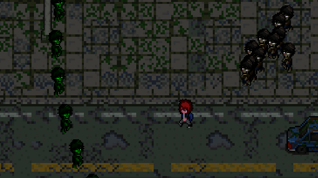
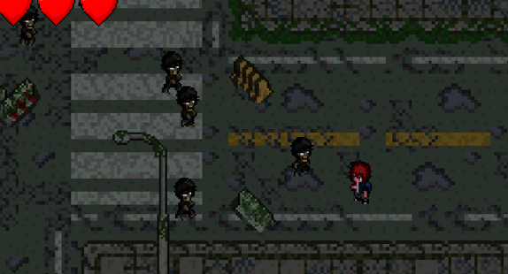
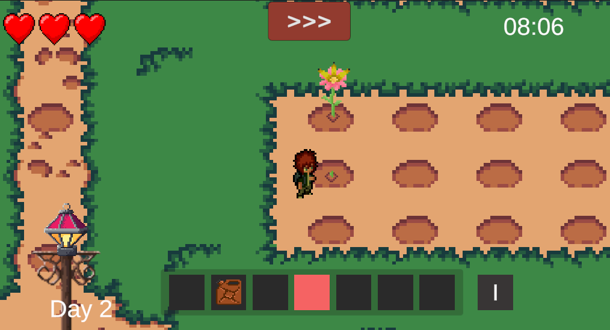
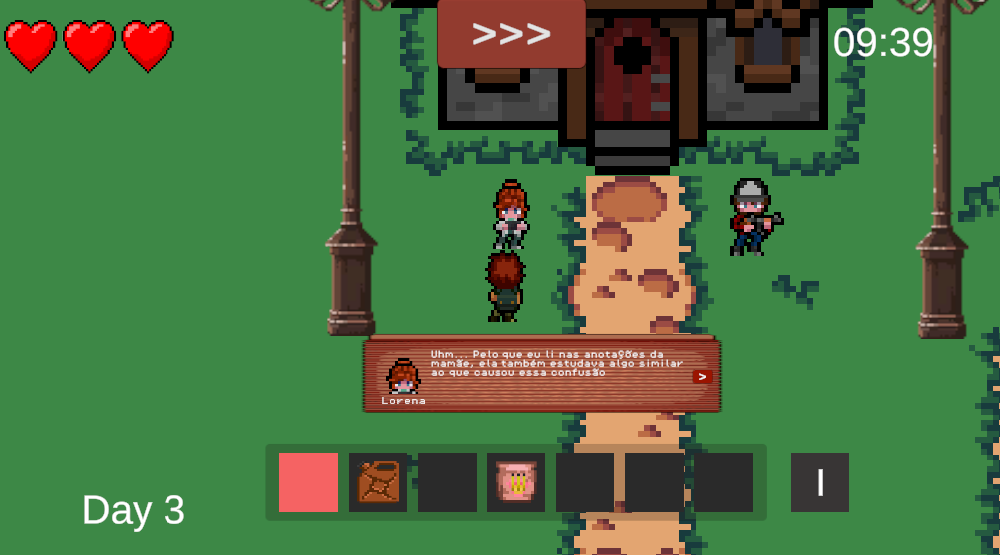

# Nightmare Fields

## Visão Geral do Jogo

**Nome do Jogo:** Nightmare Fields  
**Gênero:** Simulador de vida rural, Tiro, Zumbi  
**Plataforma:** PC  
**Público-Alvo:** Adolescente

### Resumo

Um apocalipse biológico se espalha na cidade de Seattle por conta da ganância de uma empresa. Agora cabe aos protagonistas James, Charlie e Lorena enfrentar os zumbis gerados por um novo elemento na tabela periódica, proteger a cidade e evoluir sua fazenda para salvar o mundo!

## Inspirações

### Stardew Valley

Uma experiência relaxante de cuidar da própria fazenda, mas com muito mais do que só plantar e colher. O jogo permite explorar, conhecer os moradores, criar animais, minerar e se aventurar em cavernas cheias de mistério.

### Vampire Survivors

Enfrente enxames de inimigos enquanto fica cada vez mais forte. A jogabilidade é simples, mas viciante, e tudo gira em torno de sobreviver o máximo possível escolhendo os melhores upgrades.

### Outras Referências

- Harvest Moon: Light of Hope
- Plants vs Zombies
- Ratchet and Clank: Rift Apart
- Don't Starve Together
- Brotato
- Metal Slug
- Resident Evil
- GTA V

## Mecânicas de Jogo

### Jogabilidade

- Os jogadores devem salvar a cidade através de um sistema de ondas de zumbis.
- O jogo possui um ciclo de dias: de dia, o jogador cuida da fazenda; à noite, luta contra zumbis.
- Cada personagem tem habilidades e ataques únicos.
- Cultive plantas modificadas para gerar power-ups e defender a fazenda e a cidade.
- O jogador deve sobreviver a 10 ondas cada vez mais difíceis, enfrentando diversos tipos de zumbis até o chefão final.
- Para jogadores mais corajosos, há o modo "PESADELO", onde zumbis mais poderosos aparecem, mas as recompensas são maiores.

### Controles

- **WASD** - Movimentação do jogador
- **Botão Esquerdo do Mouse** - Tiro básico / Interação com personagens
- **Botão Direito do Mouse** - Especial do personagem
- **Scroll do Mouse** - Trocar tipo de tiro
- **Esc** - Pause do jogo

### Objetivos

- Melhorar a fazenda, defender-se das 10 ondas e derrotar o chefão final.
- Lorena deve criar o antídoto para salvar a humanidade.

### Recompensas

- Zumbis podem dropar óleo para regar plantas ou sementes de power-ups.
- Sobrevivendo ao modo Pesadelo, o jogador ganha uma skin premium exclusiva.

## História e Narrativa

### Enredo

- **Ano:** 2082
- **Localização:** Seattle, Washington
- **Personagens principais:** James (62 anos), Charlie (29 anos), Lorena (30 anos)
- **Eventos importantes:**
  - Morte da esposa de James (2053)
  - Terceira Guerra Mundial (2042 - 2050)

James, veterano da Terceira Guerra Mundial, tornou-se um fazendeiro para criar seus filhos, Charlie e Lorena. Charlie herdou o gosto pela agricultura, enquanto Lorena se tornou cientista na empresa MESEQ. A MESEQ descobriu uma substância capaz de aumentar a vida útil das plantas, mas, movidos pela ganância, ignoraram os testes de segurança e lançaram o produto no mercado. O consumo dessa substância transformou as pessoas em zumbis irracionais.

Lorena descobre que sua falecida mãe, Eleanor, havia pesquisado modificações genéticas em plantas e encontra anotações que podem ser a chave para reverter a contaminação. Agora, James, Charlie e Lorena devem lutar para defender a fazenda, encontrar um antídoto e salvar Seattle.

## Personagens

### Charlie

- Filho mais velho de James
- Especialista em cultivo e defesa da fazenda
- Habilidade: Cria armadilhas e reforça barricadas

### Lorena

- Cientista e especialista em biotecnologia
- Habilidade: Desenvolve power-ups e cria o antídoto

### James

- Veterano de guerra e estrategista
- Habilidade: Planejamento tático e liderança

## Mundo do Jogo

- **Localização:** Seattle, Washington
- **Ano:** 2087
- **Cenário:** Zona rural em um mundo pós-apocalíptico com uma cidade destruída e poucos sobreviventes.

## Design de Níveis

### Estrutura dos Níveis

- **Fazenda:** O jogador cultiva plantas modificadas que ajudam na defesa e no combate.
- **Cidade:** O local dominado por zumbis onde ocorrem as batalhas.

---

### Screenshots

  
  
  
  

